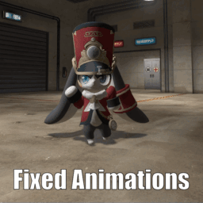
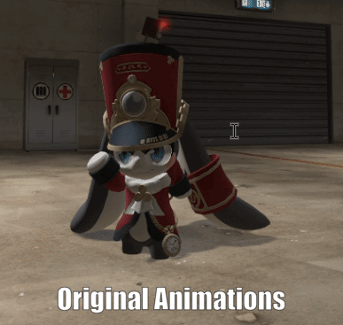
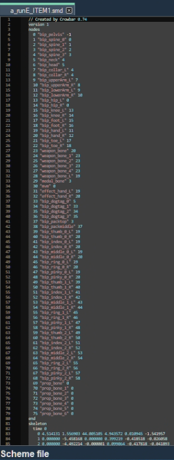

# What is this?
A script that modifies smd animation files to work with the proportion trick.
https://steamcommunity.com/sharedfiles/filedetails/?id=887935033 

It's usually more noticeable when the resulting custom model is smaller than the original models, but simply put, a small character tends to bounce a lot and ends up looking floaty or even worse just clipping through the ground or floating with some animations.

# How to use.
1. Multiply your animations by a value. Less than 1 makes any movements less noticeable. Higher than 1 makes them more pronounced.(note this only affects translations not rotations) 
2. Set Scale to 1.0 and start tweaking the Vertical Offset value with positive or negative values, while checking hlmv, until the character is grounded.

# Advanced Notes.
- The semicolon in the default_bones.txt specifies if the bone should be affected by the Vertical Offset.
This exists because you do not want to add the vertical offset to other bones than the pelvis bone, as it will throw them in a direction that is away from the character.
- You can tick or untick bones which you want to include or exclude from the scaling and vertical offset.
It's usually enough just to scale the pelvis and weapon bones, as translations on these bones are most noticeable in smaller characters.
- You should update the bone_indexes.txt to match the bones of your Original Player Model. You can get these from opening up an animation .smd from the Original Player model and copying the bone names from nodes to end.
You would also have to modify default_bones.txt as the bone names might be different now.(especially for the weapon bones)
(The formatting is whitespace sensitive so make sure it looks like the provided default_bones.txt)
Here is an image of where you can get the bone_indexes. It is just a random animation that the Base Character uses.

